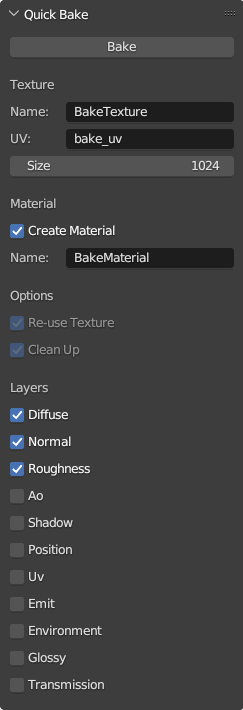

# Quick Bake

Sweet and simple baking in Blender.

## Usage

Download this repo as a zip file and install through the Blender addons.

### Interface

### Fields

Texture . Name

- Prefix for all baked texture files
- Texture files suffix is the layer name

Texture . UV

- Name of the UV layer to create use for baking
- If the layer does not exist, it will be created with a smart unwrap

Material . Create Material

- Create a material with the baked textures
- Only uses Diffuse, Normal and Roughness if enabled

Material . Name

- Name of the material to create if it does not exist

Options . R-use Texture

- Keep image node in each material used for the bake image between bakes

Options. Clean Up

- Remove nodes created for baking

Layers

- Image layers to bake
